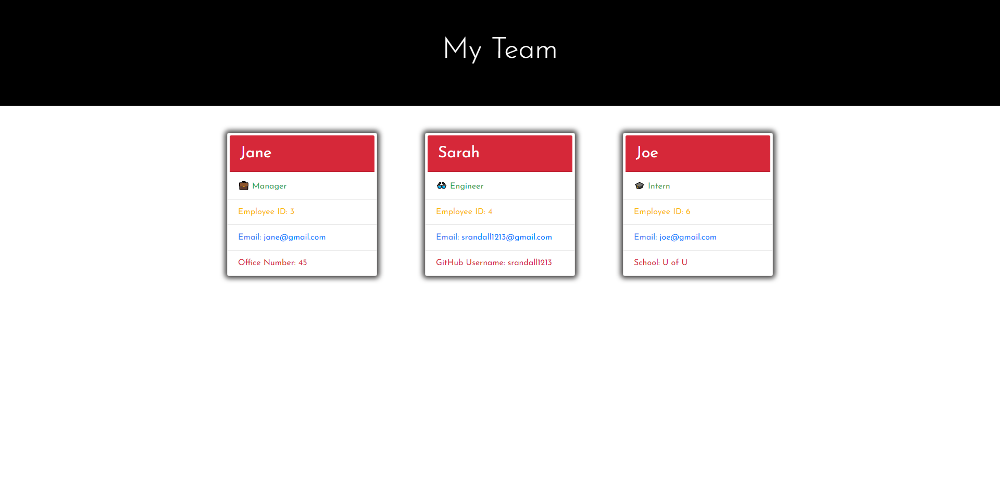

# Team-Profile-Generator

## Description

My motivation in completing this project was to apply what I learned this week about Object Oriented Programming. This includes topics such as constructors, testing, and classes.  I built this project because I wanted to test my skills and see if I could be effective in creating a Team Profile Generator. Through this project I learned more about how to format a constructor, write and fix tests, and how to create classes and subclasses. I faced a couple small challenges with this project, but mostly figuring out syntax and formatting were where I was finding my errors. 

## Sample Application Appearance

## Walkthrough Video Link
https://drive.google.com/file/d/13boZOFypag0zniqqRx-Yb-0NviBQhrsd/view